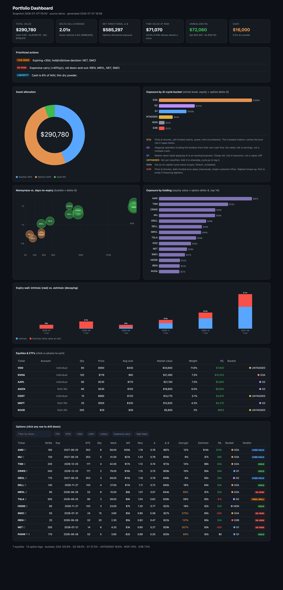

# Portfolio Analyzer

[](https://github.com/yohanncurmally/portfolio-analyzer/actions/workflows/ci.yml)
[](LICENSE)
[](https://www.python.org/downloads/)
[](#security--privacy)

A **local, read-only** tool that connects to your brokerage, pulls your holdings, and
produces an **interactive dashboard** plus a **candid, position-by-position analysis**
tailored to how you invest (equities or options, passive or active, your risk tolerance).

It runs entirely on **your own computer**, under **your own broker login**. Nothing is
hosted, nothing is uploaded, and it can **never place a trade or move money**.



<sub>Sample dashboard with fabricated holdings and numbers, not a real portfolio.</sub>

See the matching **[written analysis](docs/sample-analysis.md)** the tool produces for
this same sample book, position by position.

> ## Not financial advice
> This is a personal analysis and educational tool. It is **not** investment, financial,
> tax, or legal advice, and its authors are **not** your broker, adviser, or fiduciary.
> Nothing it outputs is a recommendation to buy, sell, or hold any security. Markets are
> risky and you can lose money. **You** are solely responsible for your own decisions.
> The software is provided **"as is," without warranty of any kind** (see [LICENSE](LICENSE)).
> Verify every number against your broker before acting on anything.

---

## What you get

- **Interactive dashboard** (opens in your browser, works offline): total value,
  allocation, exposure by holding, and concentration, plus an equities table and, for
  options, leverage/risk KPIs, an expiry wall, and a sortable, filterable options table
  where every row expands into a full drilldown. It adapts to your book, so an
  equities-only portfolio renders cleanly with no empty options panels. Charts carry
  legends (including what the AI-cycle buckets mean) and table columns have hover
  tooltips explaining each metric.
- **Written analysis**, position by position: what is working, what is risky, and the
  tradeoffs, plus a portfolio-level summary. Framed around *your* stated strategy.
- For options traders: put-correct greeks, delta-adjusted exposure, and a
  cheap-vs-expensive-leverage (carry/yr) screen. For premium sellers, the read switches
  to premium captured, assignment odds, and collateral.

**Who it fits.** It works for a plain stock-and-ETF portfolio (allocation, concentration,
drift) and goes deepest for **active, options-heavy books**, where the greeks, leverage,
and time-decay screens have the most to say. Passive index-only investors get a clean but
simpler read. It is built for **long-term analysis, not day-trading**: it reads a snapshot
of what you hold, it does not stream quotes or place orders.

## How it works

You drive it through **[Claude Code](https://claude.com/claude-code)** (or the Claude
desktop app's coding mode). It connects to your broker **read-only** via
**[SnapTrade](https://snaptrade.com)** (works for Robinhood, Interactive Brokers, and
20+ brokers) or a **direct Interactive Brokers** connection. Your credentials stay in a
local `.env` file that is gitignored and never leaves your machine.

## See it first (no sign-up, no broker)

Before connecting anything, you can run the whole pipeline against a **fabricated sample
portfolio**. It is offline, needs no account, and produces the exact dashboard and
[written analysis](docs/sample-analysis.md) shown above:

```bash
python3 -m venv .venv
.venv/bin/pip install -r requirements.txt
.venv/bin/python scripts/analyze.py --source demo
```

On Windows, use `.venv\Scripts\pip` and `.venv\Scripts\python` instead. This writes a
dashboard and analysis into `outputs/`. Nothing is fetched from the network and no broker
is involved. Once you like what you see, set up your own below.

## Quick start

You do **not** need to be technical. Claude sets it up for you.

1. Install [Claude Code](https://claude.com/claude-code).
2. Get this repo onto your computer, either way:
   - **Download ZIP**: green **Code** button above, then **Download ZIP**, then unzip, or
   - **Clone**: `git clone https://github.com/yohanncurmally/portfolio-analyzer.git`
3. Open the folder in Claude Code and say:

   > **Read SETUP_FOR_CLAUDE.md and set me up.**

That short line is enough. The setup guide already walks Claude through everything and
ends by running your first analysis.

If you want to be more explicit (recommended if you want it fully hands-off), paste this
longer prompt instead:

   > **Read SETUP_FOR_CLAUDE.md and set me up from scratch. Run the steps for me and only
   > stop to ask when you need something only I can do, like creating an account or logging
   > into my broker. When you reach the personalization step, interview me about my strategy
   > first. Then finish by running a full analysis and walking me through the dashboard and a
   > position-by-position breakdown.**

Claude will check Python, build a sandboxed environment, walk you through connecting your
broker (you log in yourself, and it only ever gets read-only access), offer to
personalize the analysis to your strategy, and run your first report. After that, just
say **"analyze my portfolio"** any time, or **"let's personalize this"** to tune it.

See **[SETUP_FOR_CLAUDE.md](SETUP_FOR_CLAUDE.md)** for the full walkthrough and
**[START_HERE.md](START_HERE.md)** for the two-minute version.

## Personalize it to how you invest

The analysis is sharper when it knows your thesis. During setup (or any time later)
Claude interviews you about how you invest: passive or active, equities or options, buy
or sell premium, risk tolerance, concentration, and any rules you follow. It writes your
answers into `docs/target_portfolio.md`. From then on the report is framed around your
plan. A passive index investor sees allocation drift and concentration. An options seller
sees premium capture and assignment risk. The engine is the same; the lens adapts to you.

## Security & privacy

- **Read-only.** Both broker paths connect read-only. The tool cannot trade or move money.
- **Your credentials stay local.** They live in `.env`, which is gitignored. Never commit
  it, never share it.
- **Your holdings stay local.** Snapshots and dashboards are written to `outputs/`, which
  is also gitignored.
- **Nothing is hosted.** There is no server, no account with us, no data collection.
- Revoke access any time: disconnect the broker in the SnapTrade dashboard, or turn off
  the API in IBKR's Gateway settings.

## Requirements

- [Claude Code](https://claude.com/claude-code) (or Claude desktop coding mode)
- Python 3.10+
- A SnapTrade developer account (free for personal use), or Interactive Brokers with
  IB Gateway/TWS

## FAQ

**Is it safe? Can it trade or move my money?**
No. Both broker paths connect **read-only**, so the tool physically cannot place a trade,
withdraw, or transfer. It reads positions and stops there.

**Where does my data go?**
Nowhere. It runs on your computer, under your broker login. There is no server and no
account with us. Your credentials live in a local `.env` file (gitignored), and your
holdings and dashboards are written to `outputs/` (also gitignored). Nothing is uploaded.

**Which brokers work?**
Via SnapTrade: Robinhood, Interactive Brokers, and 20+ others (brokerage, IRA, and crypto
accounts sync together). Or connect **Interactive Brokers directly** through IB Gateway.

**I only own stocks and ETFs, no options. Is it still useful?**
Yes. You get total value, allocation, concentration, and per-holding gain/loss. The
options-specific screens (greeks, leverage, carry) simply do not appear if you hold none.

**Does it cost anything?**
The tool is free (MIT). A SnapTrade developer account is free for personal use. You need
[Claude Code](https://claude.com/claude-code), which has its own pricing.

**Do I need to know how to code?**
No. Claude Code runs the setup and the analysis for you. The one manual step is logging
into your own broker, which only you can do.

**I'm on Windows.**
It works. Wherever the commands show `.venv/bin/python`, use `.venv\Scripts\python`
instead (and `.venv\Scripts\pip` for pip). Claude handles this for you during setup.

**Is this financial advice?**
No. It is a personal analysis and educational tool. See the disclaimer near the top and
the [LICENSE](LICENSE). Always verify numbers against your broker before acting.

## License

[MIT](LICENSE). Free to use, modify, and share, with no warranty. See the disclaimer above.
